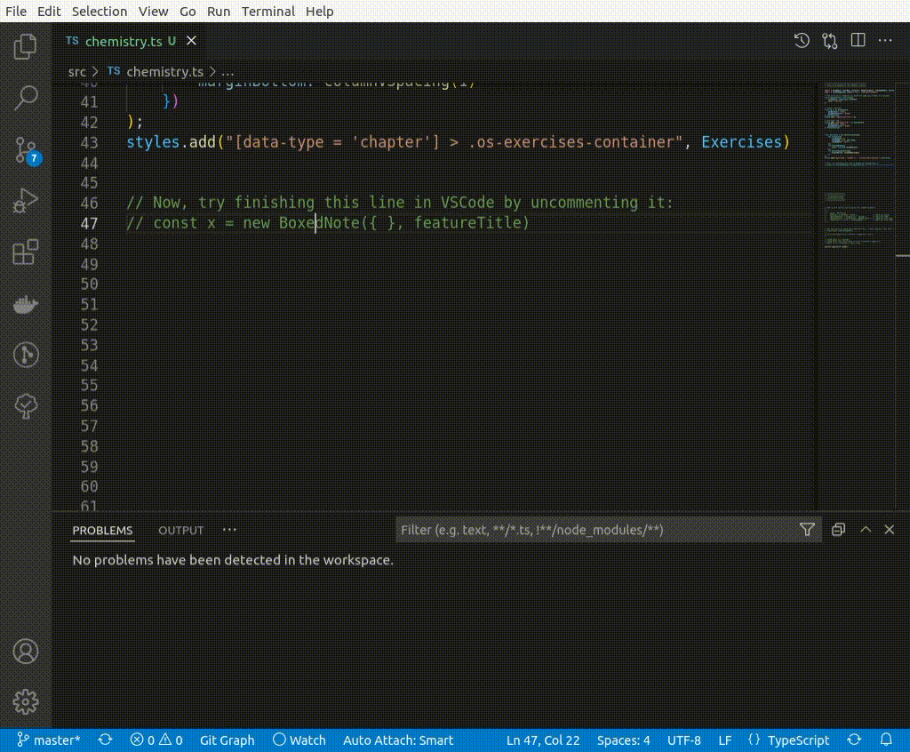

# stylish

## Install & Run

[](https://gitpod.io/from-referrer/)

Or run locally:

```sh
npm install
npm run ts    # for the TypeScript example
npm run xml   # for the XML example
```

### TypeScript

With this method, a design defines classes whose values will be filled in when they are instantiated in the books file. The book file instantiates classes with values and then calls toCSS() to convert the code to CSS.

By using TypeScript the editor can autocomplete when devs are writing the `chemistry.ts` file.

Files:

- [chemistry.ts](./src/ts-example/chemistry.ts) contains all the Book styling.
- [design.ts](./src/ts-example/design.ts) defines all the classes that will be instantiated with values.
- [framework.ts](./src/ts-example/framework.ts) defines all the base classes as well as a `styles.toCSS()` that converts all the instantiated classes (Objects) to CSS.

**Note:** the whole file is pretty much just instantiations of classes, no conditionals or loops which one would expect in a programming language.

<details>
<summary>Click to see the generated CSS output from the TypeScript files</summary>

```css
.chemist-portrait {"fontName":"Arial","borderColor":"blue","groupBorderColor":"green"} .chemist-portrait [data-type="title"] {"fontFamily":"Comic Sans","color":"yellow"}

.everyday-life {"fontName":"Arial","borderColor":"blue","groupBorderColor":"green"} .everyday-life [data-type="title"] {"fontFamily":"Comic Sans","color":"yellow"}

[data-type = 'chapter'] > .os-exercises-container {} [data-type = 'chapter'] > .os-exercises-container [data-type="os-container"] {"columnCount":2,"columnGap":[2.4,"rem"],"columnWidth":"auto"}

[data-type = 'chapter'] > .os-exercises-container [data-type="os-problem-number"] {"color":"#000"}

[data-type = 'chapter'] > .os-exercises-container [data-type="os-problem-number"] {"marginBottom":""}
```

</details>

### Autocompletion

A major feature of this method over SASS is that developers have type hints so folks don't have to remember all of the arguments to style a component:




### Notes

A Turing-Complete language like TypeScript is probably overkill for something that generates CSS since styling a book does not need to perform conditionals & loops. The features that do seem useful are:

- creating instances of objects
- defining and using variables to deduplicate code
- type-checking and autocompletion


## XML

This option uses XML data files to store the styling information, XSD files to autocomplete in the editor, and eventually sourcemaps to link devs back to the source information when viewing the CSS in a browser.

Files:

- [sociology.xml](./src/xml-example/sociology.xml)
- [design.xml](./src/xml-example/design.xml)
- [framework.xsd](./src/xml-example/schemas/framework.xsd)
- [generate-design.xsl](./src/xml-example/schemas/generate-design.xsl): Generates a schema from the design file that is used for validating the book XML file.

### Install prerequisites

This demo requires `xsltproc` and `xmllint` (for validating)

### XML Screencap

This shows autocompletion of the `chemistry.xml` file and sourcemapping in the browser

[Screencap of Autocomplete and Sourcemapping](https://philschatz.com/stylish/xml-example.mp4)


# Explorations

Here are some notes from the different explorations we did: TypeScript, XML, and TSX.

## Current Framework

Components and Shapes in the current framework have a few features:
- Each Shape has a selector that never changes.
- Each Component has a subselector that never changes.
- Each Component has properties on it that can be set, optional, or required.
- Each Shape has a tree of Components whose required properties must be filled in once the Shape is instantiated.

A [Shape instance](https://github.com/openstax/ce-styles/blob/main/styles/books/sociology/book.scss#L61-L71):

```less
@include add_settings((
    BigPicture: (
        _selectors: ('.sociology-big-picture'),
        'Title:::color': (_ref: 'colorMap:::boxedNoteTitleColor'),
        'Title:::font-family': (_ref: 'typography:::titleOption3Font'),
        'Title:::background-color': (_ref: 'colorMap:::boxedNoteTitleBackgroundOption2Color'),
        'Title:::border-color': (_ref: 'colorMap:::boxedNoteTitleBorderColor'),
        'Body:::font-family': (_ref: 'typography:::titleOption2Font'),
        'Body:::background-color': (_ref: 'colorMap:::boxedNoteBodyBackgroundOption2Color'),
        'Subtitle:::color': (_ref: 'colorMap:::fontBodyColor'),
        'Subtitle:::font-family': (_ref: 'typography:::titleOption1Font'),
    ),
));
@include use('BigPicture', 'cosmos:::BoxedNoteWithSubtitleShape');
```

A [Shape definition](https://github.com/openstax/ce-styles/blob/main/styles/designs/cosmos/parts/notes/_notes-boxed-shapes.scss#L15-L29):

```less
@include create_shape('cosmos:::BoxedNoteWithSubtitleShape', (
    _components: (
        map-merge($Notes__Container, (
            _components: (
                $Notes--Boxed__Title,
                map-merge($Notes--Boxed__Body, (
                    _components: (
                        $Notes--Boxed__Subtitle,
                        $UnorderedList--NotesQuestionSection,
                    )
                )),
            )
        )),
    )
));
```

A [Component definition](https://github.com/openstax/ce-styles/blob/37de324696b2813a57e8c12c5908f3e0c383dbd8/styles/designs/cosmos/parts/notes/_notes-components.scss#L105-L122):

```less
$Notes--Boxed__Title: (
    _name: "Title",
    _subselector: ' > .os-title',
    _properties: (
        color: enum('ValueSet:::REQUIRED'),
        font-family: enum('ValueSet:::REQUIRED'),
        font-size: font-scale(1),
        line-height: line-height(1),
        text-transform: uppercase,
        text-align: right,
        font-weight: normal,
        background-color: enum('ValueSet:::REQUIRED'),
        padding: v-spacing(1),
        position: relative,
        border-bottom: solid 0.2rem,
        border-color: enum('ValueSet:::REQUIRED'),
    )
);
```

## TypeScript

The main drawback of this method is that there does not seem to be a good way to create a sourcemap. Adding even partial sourcemap support would require injecting file/line/column information into every object that is instantiated by creating a Babel Transpilation step kind of like how code coverage counters are injected.

Advantages:

Drawbacks: 

- No Sourcemaps
- It's code but we're not looping or having conditionals so it seems excessive to generate a CSS file
- Lots of boilerplate code to get the classes to line up nicely (see design.ts file)
- It's typed but VSCode's autocomplete for `{}` is not very good. It does not autofill required fields so you have to hover wait for documentation or guess by typing one character at a time.

```ts
const featureTitle = new Title({
    fontFamily: typography.titleFont, 
    color: 'yellow'
})

// Chemist Portrait
const cp = new BoxedNote({
    borderColor: 'blue',
    groupBorderColor: 'green'
}, featureTitle)
styles.add('.chemist-portrait', cp)
```

## XML

Advantages:

- Sourcemaps!

Disadvantages:

- Adding features like Click-to-definition would require creating a LanguageServer (we did it in POET for CNXML, another XML language)
- Validation is either done via an autogenerated XSD file (it works!) or as code inside a LanguageServer


## TSX

With this approach I was hoping to use the TSX syntax for constructing nested objects, filling out values by using literals or variables (with free click-to-definition) but not actually use React.render().

It has lots of promising properties:
- Typed components & typed name-value pairs (the elements and attributes)
- Nesting components

### SimpleNote

Let's start by creating a "Tip" which is an instance of a SimpleNote.
It has a borderColor and will eventually contain a `<NoteTitle>` and `<NoteBody>` that will style the Title and Body of the Tip.

```tsx
const primaryColor = 'red'

class SimpleNote extends Shape<{borderColor: string}> { }

const tip = (<SimpleNote borderColor={primaryColor}/>)

tip.props // { borderColor: 'red' }

tip // !!! a React.JSX.Element, NOT a SimpleNote !!!
```

### NoteTitle

There isn't a trivial way to set a selector on a whole "class".
With a little hack it is possible though. We define instance variables in the class and then instantiate the class to read those variables.

```tsx
class NoteTitle extends Component<{backgroundColor: string}> { subSelector = ' > title'; defined = { color: 'blue' } }

const o = (<NoteTitle backgroundColor='green'/>)

o.props // { backgroundColor: 'green' }

// To get the selector & defined fields we need to do some work:
o.type // NoteTitle constructor
o.type === NoteTitle // true
const i = new (o.type)()
i.subSelector // ' > title'
i.defined // { color: 'blue' }
```

### Combining SimpleNote and NoteTitle

Now let's finish styling the Tip by combining the SimpleNote and the NoteTitle. To allow children, we need to update the SimpleNote props.

Here is the resulting code:


```tsx
const primaryColor = 'red'

class SimpleNote extends Shape<{borderColor: string, children: React.JSX.Element }> { selector = 'div[data-type="note"]' }
class NoteTitle extends Component<{backgroundColor: string}> { subSelector = ' > title'; defined = { color: 'blue' } }

const tip = (
    <SimpleNote borderColor={primaryColor}>
        <NoteTitle backgroundColor='green'/>
    </SimpleNote>
)
```

And we can get this to work as expected. With some convoluted code that walks the tree inside `tip`, we can get the props _and_ the fields defined on each class and combine the selectors.... BUT...

### The Wall

This is where we hit a wall. There's nothing that forced us to put a `<NoteTitle>` inside that `<SimpleNote>`. In fact we could have put anything in there and TypeScript would have been equally as happy:

```tsx
const tip1 = (<SimpleNote><div/></SimpleNote>)
const tip2 = (<SimpleNote>yeehaw!</SimpleNote>)
const tip3 = (<SimpleNote><ExerciseProblem/></SimpleNote>)
```

We could design the framework in a way that allows for arbitrary children but that seems to run contrary to the goal of having autocomplete.