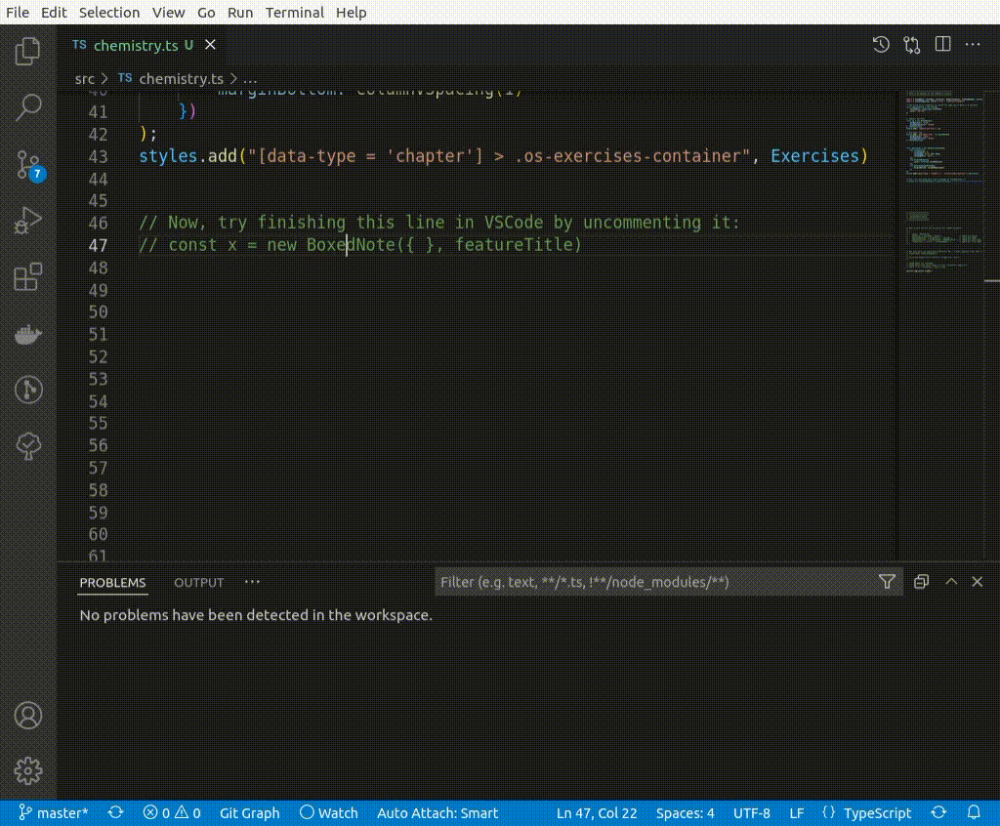

# stylish

## Install & Run

[](https://gitpod.io/from-referrer/)

Or run locally:

```sh
npm install
npm run start
```

<details>
<summary>Click to see the generated CSS output</summary>

```css
.chemist-portrait {"fontName":"Arial","borderColor":"blue","groupBorderColor":"green"} .chemist-portrait [data-type="title"] {"fontFamily":"Comic Sans","color":"yellow"}

.everyday-life {"fontName":"Arial","borderColor":"blue","groupBorderColor":"green"} .everyday-life [data-type="title"] {"fontFamily":"Comic Sans","color":"yellow"}

[data-type = 'chapter'] > .os-exercises-container {} [data-type = 'chapter'] > .os-exercises-container [data-type="os-container"] {"columnCount":2,"columnGap":[2.4,"rem"],"columnWidth":"auto"}

[data-type = 'chapter'] > .os-exercises-container [data-type="os-problem-number"] {"color":"#000"}

[data-type = 'chapter'] > .os-exercises-container [data-type="os-problem-number"] {"marginBottom":""}
```

</details>

## Autocompletion

A major feature of this method over SASS is that developers have type hints so folks don't have to remember all of the arguments to style a component:




## Notes

A Turing-Complete language like TypeScript is probably overkill for something that generates CSS since styling a book does not need to perform conditionals & loops. The features that do seem useful are:

- creating instances of objects
- defining and using variables to deduplicate code
- type-checking and autocompletion